# DADDJOKES

Dadjokes is not just another website; it's your go-to destination for a guaranteed laugh! Whether you're in the mood for a quick chuckle or eager to share your own comedic gems, Dadjokes promises to leave you amused. With a diverse collection of jokes catering to various tastes and humor styles, there's something for everyone.
As a registered user, you have the power to like, comment on, and rate every joke you come across. Feeling hesitant about sharing your own joke? Fear not! Dadjokes encourages creativity and welcomes contributions from users like you. Plus, you have the flexibility to edit or delete your joke at any time, ensuring that you feel comfortable and in control of your content.

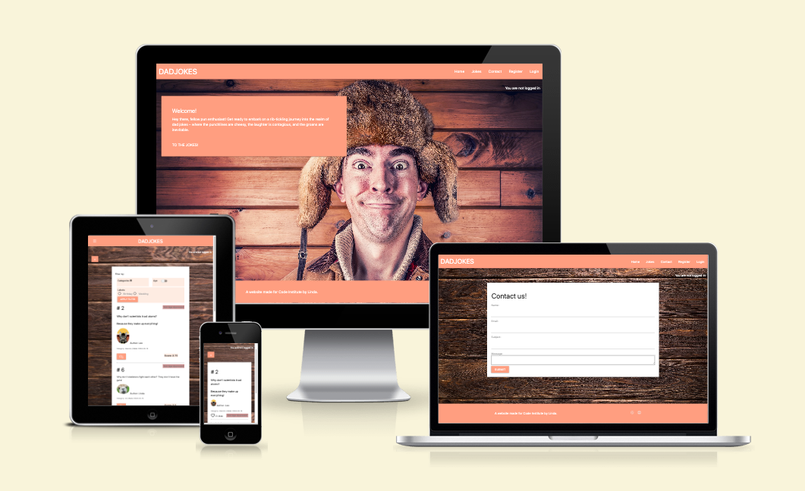

Link to deployed site:
[DADJOKES](https://dadjokes-27b9bc740f4b.herokuapp.com/)

## User Experience

### Project Goals

The goal for DADJOKES was to create an easy-to-navigate site that users can visit when they lie on the couch watching a bad movie or are on the train during a workday morning. It should be a site where users can get away for a little while.

### Agile Methodology

Agile Methodology was used to help prioritize and organize tasks for the hole webpage. I used Project Boards on Github.

* Epics were written containing possible user stories and based on that the website was made.
* User stories were created by looking at epics and added on as the project was advancing.
* Project Board was used to track progression of the task through the Todo, In progress and Done columns

 Userstories / Project board

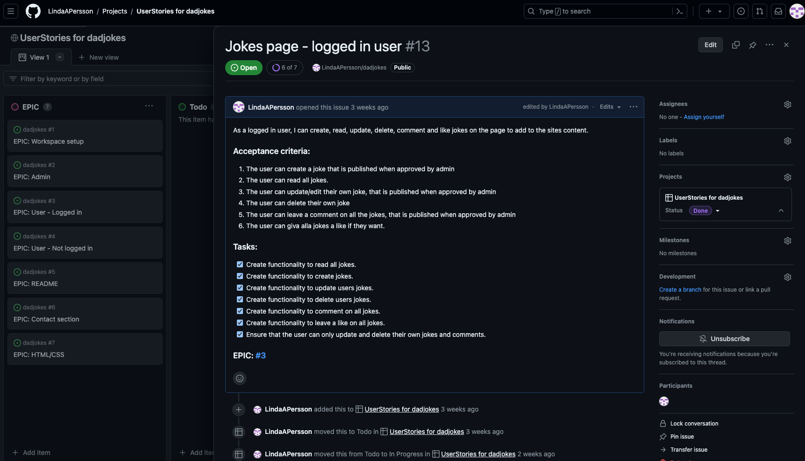
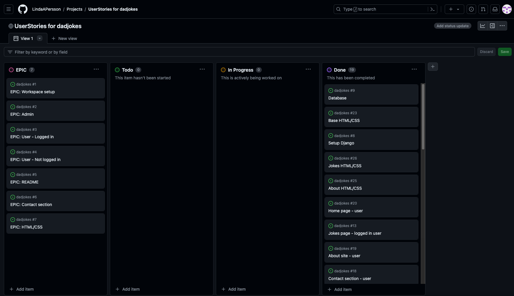
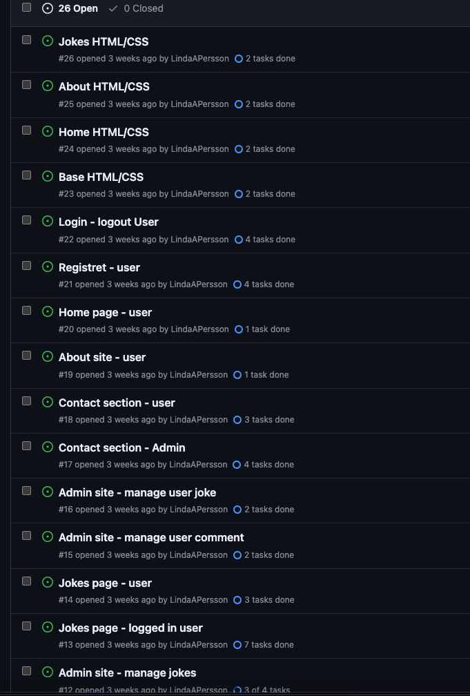

To see the Epic and user stroies in full: [project board](https://github.com/users/LindaAPersson/projects/6)

### User Stories

#### First time user

As a first-time user of DADJOKES, I want to easily navigate the website,
so I can quickly find and enjoy a variety of funny jokes and anecdotes.
I also want clear instructions on how to interact with the site,
such as registrer, liking and commenting on jokes,
so I can fully engage with the community and have a positive experience.

#### Registred user

As a registered user of DADJOKES I want to have the ability to like, comment on, and rate jokes, so I can interact with the content and contribute to the community's enjoyment.
Additionally, I want the option to add my own jokes to the platform. I also want to be able to edit and delet my comments and jokes. 

#### Admin user

As an admin user of DADJOKES, I want to have access to backend functionalities,
so I can manage and moderate the content effectively.
I also want the ability to review and approve user-submitted jokes,
so I can ensure the quality and appropriateness of the content on the platform.

## Design

I want DADJOKES to have a positive feeling, and that is reflected in the choice of light and cheerful colors throughout the site. While the current imagery inventory is modest, each selection embodies a playful and goofy spirit, intended to evoke laughter and joy. The site has a clear structure with the jokes on a white background so they are easy to read.

### Color

This palette of colors laid the groundwork for the colors that ended up on the site. However, it's not the exact color codes, as the Materialize color scheme was predominantly used.
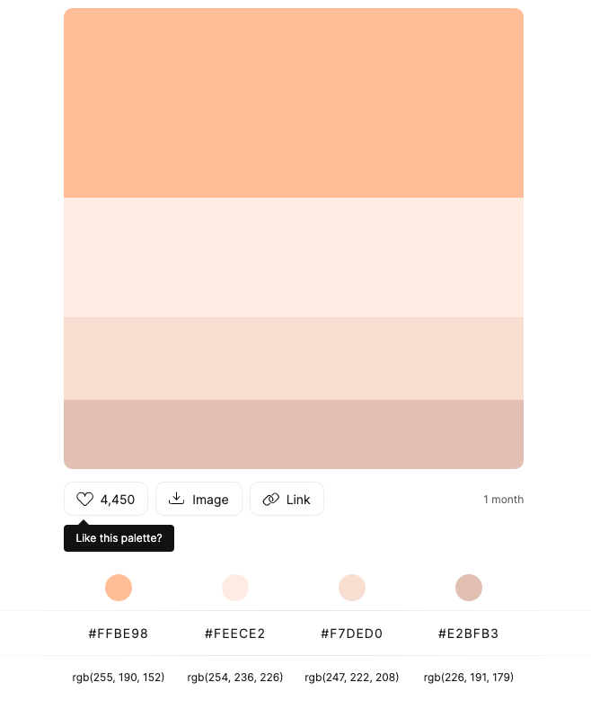

### Wireframes

While planning this site, I sat down with pen and paper and sketched out the outlines of how I wanted the site to be. Since then, the structure and the number of pages have changed. However, the essence of what I drew is still there.

 Wireframes

## Database scheme

* I utilized Graphviz to create an accurate image depicting the structure of the database. The visualization provides a clear overview of how different tables and relationships are organized within the database schema. It's worth noting that some of the features, such as user authentication and authorization, are included as part of the installation of Allauth, a comprehensive authentication framework for Django. These features are integral to the functionality of the application and have not been altered or customized extensively. However, the database schema also includes custom models and relationships specific to the requirements of the project, all of which are represented in the visualization.

 Entity Relationship Diagram (ERD)

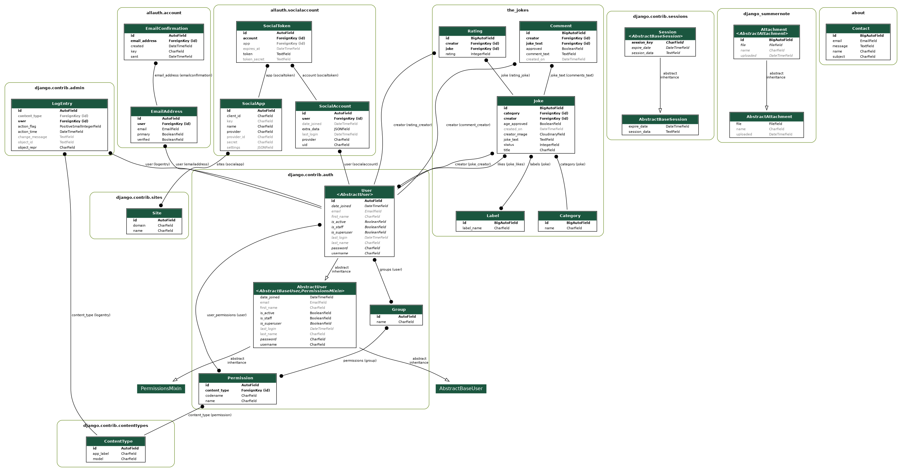

## Security Features

### User Authentication

* Django Allauth is a popular authentication and authorization library for Django, which provides a set of features for managing user authentication, registration, and account management.

### Login Decorator

* To add, edit, or delete a joke or a comment, users are required to authenticate using the login_required decorator. This ensures that only authenticated users can access these views.

### CSRF Protection

* Django provides built-in protection against Cross-Site Request Forgery (CSRF) attacks. CSRF tokens are generated for each user session, and they are required to submit forms or perform state-changing actions. When a user logs out, the session and associated CSRF token are invalidated, making it difficult for an attacker to forge a valid request using a copied URL.

### Form Validation

* Django Form Validation is a process that ensures the data submitted via HTML forms meets certain criteria. If all validation rules are satisfied, the form is completed. Otherwise, it populates the form with error messages

### Custom error pages

* 404 Error Page, provides user with a button the redirect to home page.
* 500 Error Page, provides user with a button the redirect to home page.

## Features

### Existing Features 
On the entire page, the messages 'You are not logged in' or 'You are logged in as...' are visible so the user always knows. If the user submits, edits, or deletes anything, they receive a message explaining what's happening.

The Home page (index.html) 
* A navigation bar that alters depending on screen size.
* A footer that contains links to social media platforms.

 Home

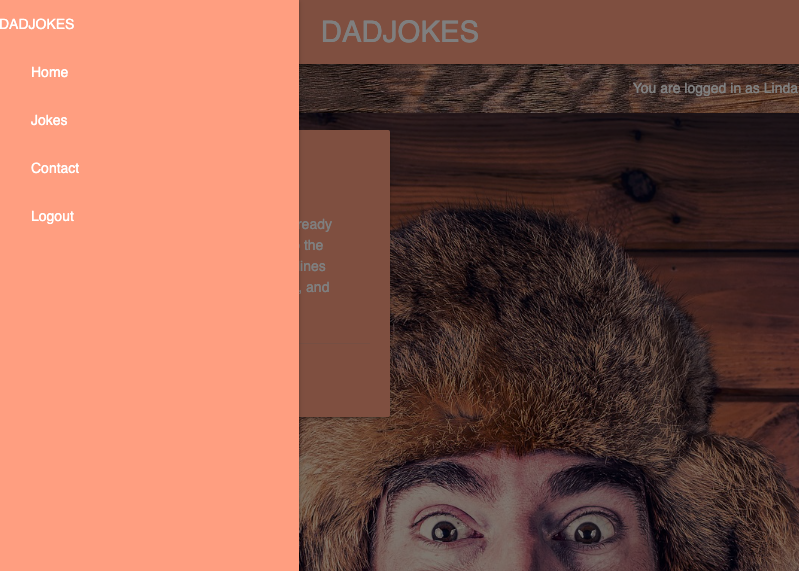
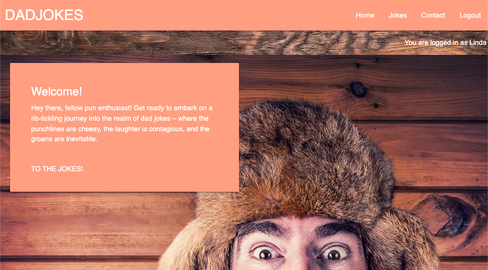

The jokes (the_jokes.html)
* Displays the jokes.
* Displays the creator image. If the user has chosen their own image, that one will appear; otherwise, a placeholder image will appear.
* Options to filter the jokes by categories, age, and labels.
* A button for comments.
* A button to edit the joke (only appears if the joke creator is logged in).
* Average score of the joke.
* A rate box if the user is signed in. The rate box has information that the user can hover over to get more details about how the rating works.

 The jokes

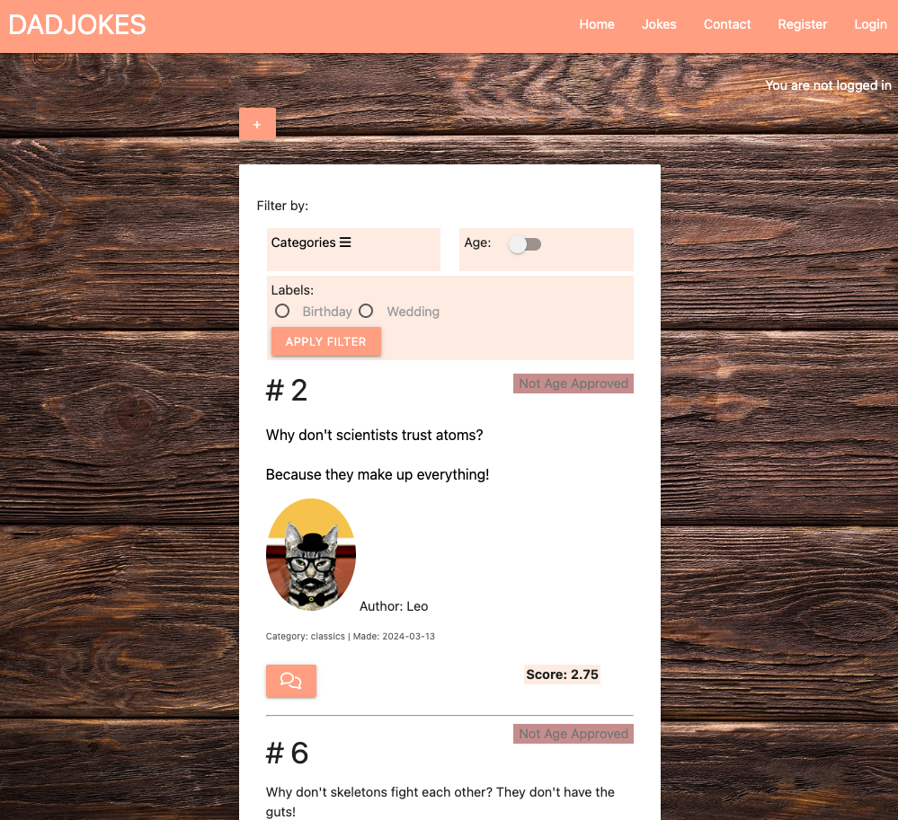
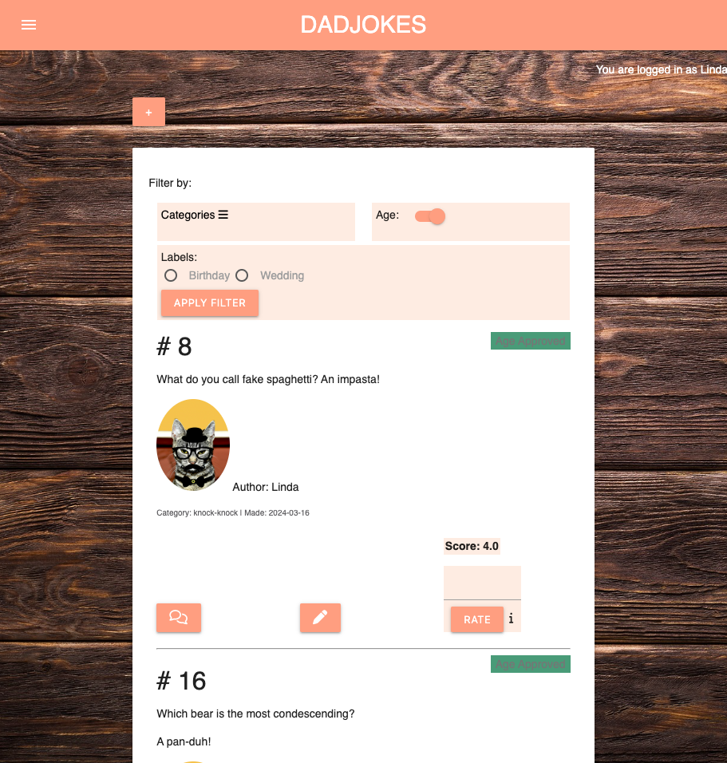

Add jokes (ad_jokes.html)
* If the user is not logged in, a message with the text 'Log in to add a joke' appears.
* When the user is logged in, a form appears that the user can fill out.

 Add jokes

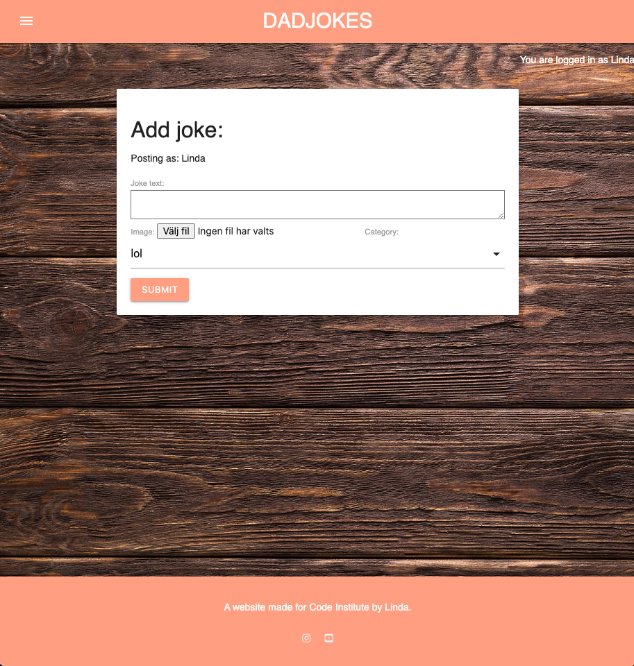

Edit jokes (edit_jokes.html)
* If the user is not logged in, the edit button will not appear.
* When the user is logged in, an edit button will display on their own jokes.
* Clicking on the edit button, a form appears that the user can fill out.

 Edit jokes

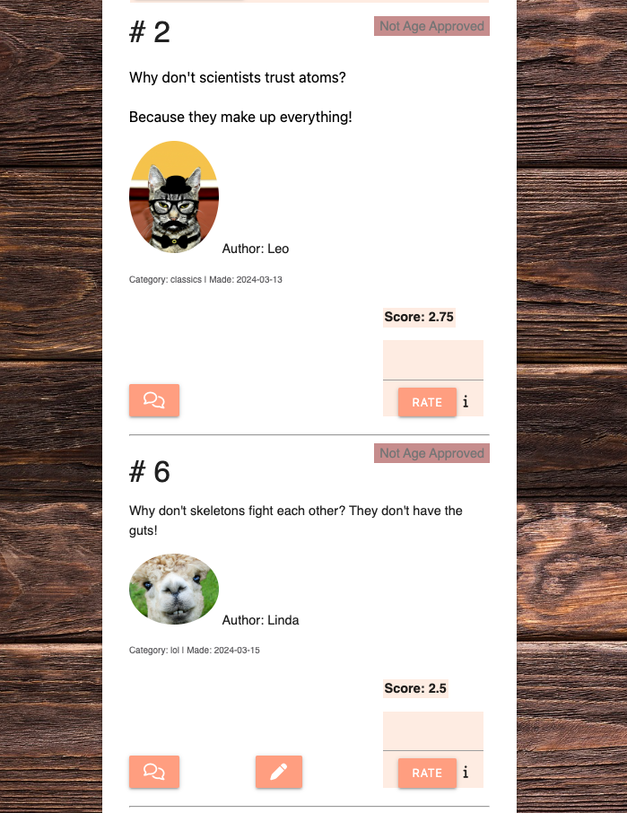
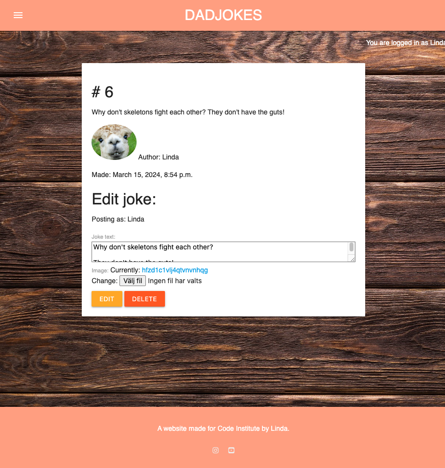

Jokes Detail (jokes_detail.html)
* If the user is not logged in, the comments will only be readable.
* When the user is logged in:
    * Leave a comment
    * Edit their own comment
    * Delete their own comment
    * Like/unlike a joke

 Jokes detail

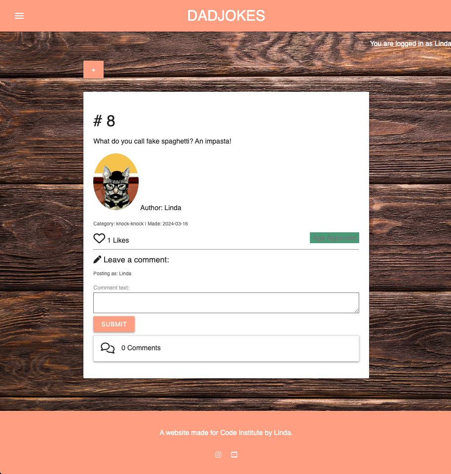
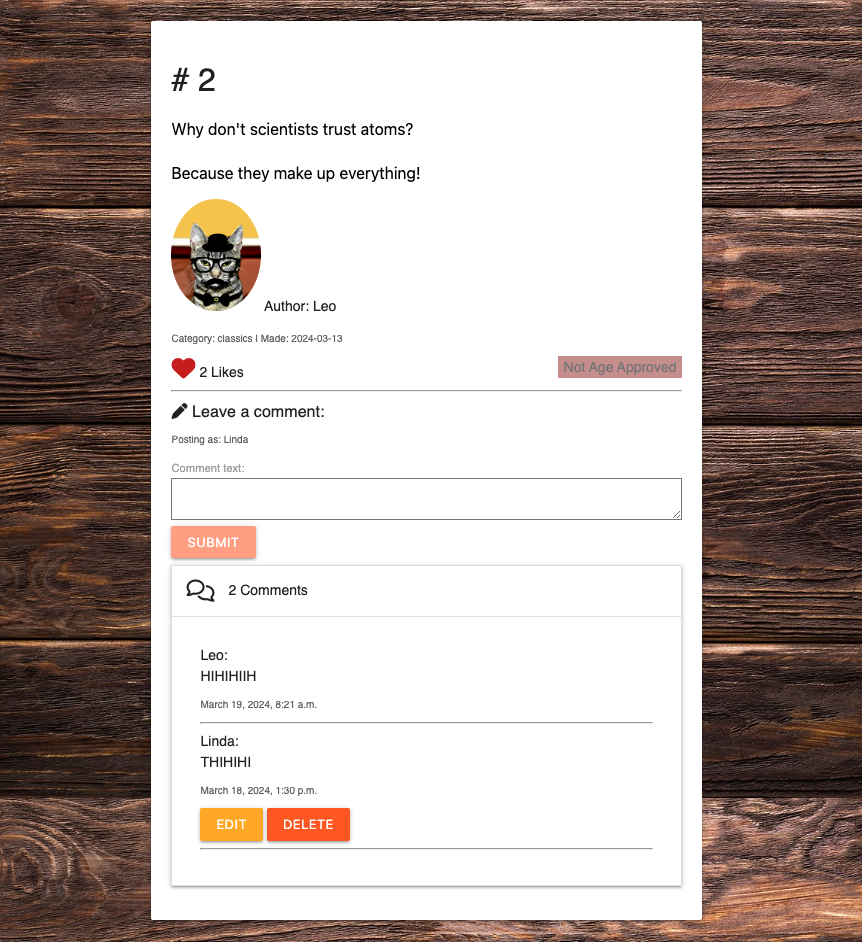

Contact (contact.html)
* Displays a contact form that all visitors can fill out

 Contact

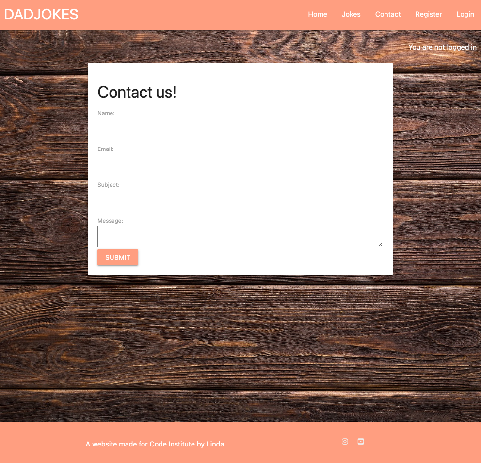

Admin 

* Django's built-in admin panel allows admin control over the website.
* Admins can add, update, and delete jokes, comments, labels, and categories.
* Admins can read all contact forms that are submitted.

Error Pages

*There are custom 404 and 500 error pages set up.
*They contain buttons to redirect to home page if there is an error.

### Future Features

* Change the structure so that the admin don't need to approve all comments before they are displayed. And instead implement a 'Report Comment' button for users to report inappropriate or offensive comments. Admins can then review reported comments and take appropriate action, such as editing or removing them if necessary.

* Implement social sharing functionality that allows users to easily share their favorite jokes with friends and followers on various social media platforms such as Facebook, Twitter, and Instagram.

* Incorporate a diverse range of content beyond just text-based jokes, such as funny images, memes, or GIFs. And introduce additional genres of jokes to appeal to a broader audience. This could include puns, one-liners, anecdotes, riddles, or even interactive quizzes and games.

* One of the upcoming enhancements for the project is to reintegrate Summernote into the admin panel. Summernote is a editor that easily helps format text, add images, and customize the appearance of the content. By including Summernote, admin will have access to a more intuitive and user-friendly editing experience, enabling them to create and edit jokes with greater flexibility and creativity. Additionally, Summernote will enhance the aesthetic appeal of the editing interface, making it more visually engaging. This integration aligns with the project's goal of providing a seamless and enjoyable user experience, and it will contribute to making the platform more dynamic and interactive.

## Technologies Used

### Languages Used

* [HTML5](https://en.wikipedia.org/wiki/HTML5)
* [CSS3](https://en.wikipedia.org/wiki/CSS)
* [JavaScript](https://en.wikipedia.org/wiki/JavaScript)
* [Python](https://en.wikipedia.org/wiki/Python_(programming_language))

### Databases Used

* [ElephantSQL](https://www.elephantsql.com/) - Postgres database
* [Cloudinary](https://cloudinary.com/) - Online static file storage

### Frameworks Used

* [Django](https://www.djangoproject.com/) - Python framework
* [materializecss](https://materializecss.com/) - CSS framework

### Programs Used

* [Github](https://github.com/) - Storing the code online
* [Gitpod](https://www.gitpod.io/) - To write the code.
* [Heroku](https://www.heroku.com/) - Used as the cloud-based platform to deploy the site.
* [Google Fonts](https://fonts.google.com/) - Import main font the website.
* [Am I Responsive](https://ui.dev/amiresponsive) - To show the website image on a range of devices.
* [Pixabay](https://pixabay.com/sv/) - All images on the site are from Pixabay.
* [Git](https://git-scm.com/) - Version control
* [Favicon Generator](https://favicon.io/) - Used to create a favicon
* [JSHint](https://jshint.com/) - Used to validate JavaScript
* [W3C Markup Validation Service](https://validator.w3.org/) - Used to validate HTML
* [CSS Validation Service](https://jigsaw.w3.org/css-validator/) - Used to validate CSS
* [CI Python Linter](https://pep8ci.herokuapp.com/#) - Used to validate Python

## Deployment:
First, I created a new repository on GitHub using a template provided by Code Institute. I took the following steps:

1. Log into GitHub.
2. Locate the right template.
3. Click on "Use this template" to create a new repository.
4. Choose a repository name and create the repository.

The development environment used for this project was GitPod.

The project was deployed using Heroku, following these steps:

First, the Code Institute template provides a document called "requirements.txt," and this file needs to contain a list of all libraries the project needs to run. Otherwise, Heroku won't be able to run the project.

Then follow these steps:
1. Login to Heroku (Create an account if necessary).
2. Click on "New" in the Heroku dashboard and select "Create new app."
3. Write a name for the app, choose your region, and click "Create App."
4. In the settings tab for the new application, create one Config var with the name PORT and a value of 8000.
5. In the settings tab for the new application, create one Config var with the name SECRET_KEY and a value of your secret key.
6. In the settings tab for the new application, create one Config var with the name CLOUDINARY_URL and a value of your own Cloudinary API key.
7. In the settings tab for the new application, create one Config var with the name DISABLE_COLLECTSTATIC and a value 1 - this is temporary, and can be removed for the final deployment.
8. In the settings tab for the new application, create one Config var with the name DATABASE_URL and a value of your own ElephantSQL database URL.
9. In the deployment tab, select GitHub as the deployment method and confirm your choice.
10. In the "Connect to GitHub" field, search for your repository name and click on the connect button next to the right repository.
11. Choose between automatic deploys or manual deploys. I chose automatic deploys.
12. When the app is deployed, a link will appear at the bottom of the page.

## Testing
Please see  [TESTING.md](TESTING.md) for all the detailed testing performed.

## Credits
* I got a lot of inspiration for this site from the walkthrough project 'I Think, Therefore I Blog.' That project was instrumental in helping me get started and provided a solid foundation for my own project. By studying its structure, features, and implementation details, I gained valuable insights into building a successful web application centered around user-generated content
* When creating the rating function, I encountered challenges in calculating the average score from all the ratings. Fortunately, this site provided invaluable assistance and guidance precisely when I needed it most. 
[Rating](https://medium.com/geekculture/django-implementing-star-rating-e1deff03bb1c)
* The link provided valuable assistance with pagination. [Pagination](https://www.geeksforgeeks.org/how-to-add-pagination-in-django-project/)