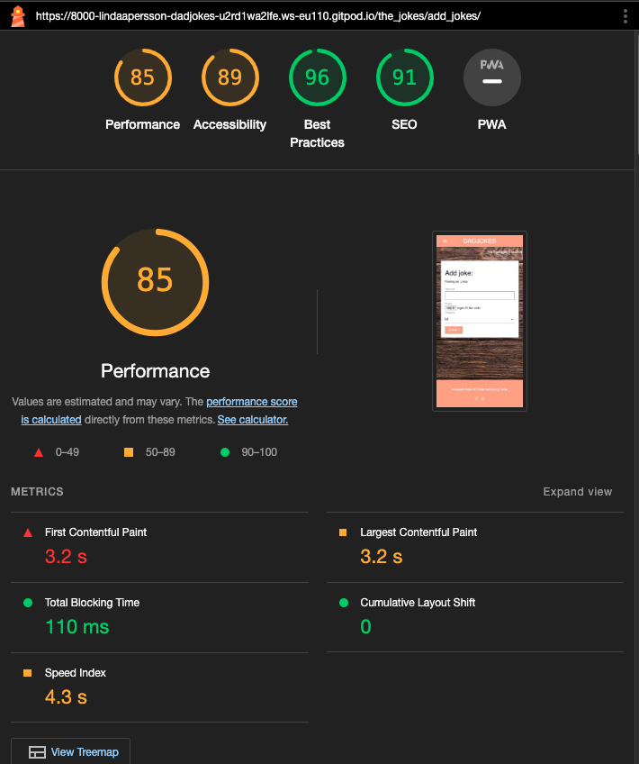
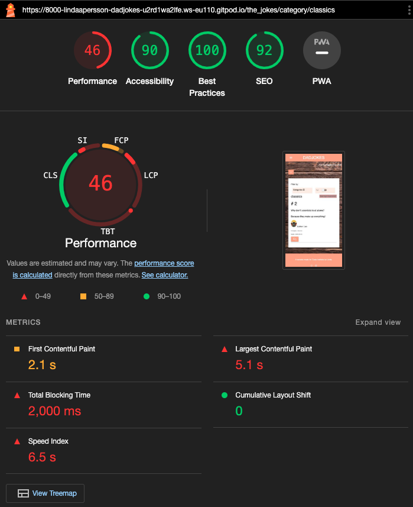

# Dadjokes

This file only contains the exstensive testing done to the webpage. All other information regarding the site will be found in [README](README.md).

## Responsvie Testing 
The deployed website was tested to ensure its responsiveness and adaptability. Developer Tools were used during development to see how the website behaves across different devices. Materlize were implemented to achieve the desired design, ensuring that the website maintains its visual and functional integrity on all platforms, enhancing the user experience.

Here are screenshots of the responsive design, both as login and not loged in. 

 Desktop/Laptop

 Tablet

 Mobile

## Browser and device Compatibility Testing
The webpage was tested on different webbrowsers to ensur a good experience for the users. The webpage was tested on following browsers and devices:

 Safari

 Google chrome

 Iphone

## Code Validation

### HTML 
Testing made trough W3 Validator. All pages got one error (see below). But other then that it looks good.

 Home/index.html

 Jokes/the_jokes.html

 Jokes/jokes_detail.html

 Categories/category.html

 Add joke/add_joke.html

 Edit joke/edit_joke.html

 Contact/contact.html

 Login/login.html

 Logout/logout.html

 Registrere/signup.html

 Error 404/404.html

 Error 500/500.html

### CSS

 Custom CSS/style.css

### JavaScript

I utilized Materialize for styling and effects, so much of the JavaScript code is derived from their pre-made templates.

 script.js

 comments.js

 jokes.js

### Python

#### About

 Admin

 Models

 Urls

 Views

#### Home

 Urls

 Views

#### The Jokes

 Admin

 Forms

 Models

 Urls

 Views

## Lighthouse Report

Under every category, there are two screenshots provided: one tailored for desktop viewing and another optimized for mobile devices. This dual presentation ensures that users can visualize the interface across different screen sizes, enhancing their understanding of the layout and design responsiveness. 

 Home

Desktop

Mobile

 Jokes

Desktop

Mobile

 Jokes detail

Desktop

Mobile

 Add Jokes

Desktop

Mobile

 Edit Jokes

Desktop

Mobile

 Category

Desktop

Mobile

 Contact

Desktop

Mobile

 Login

Desktop

Mobile

 Logout

Desktop

Mobile

 Register

Desktop

Mobile

## Feature Testing

